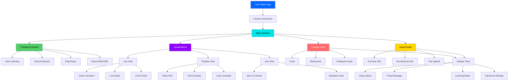

# Interface Organization Map - Simple & Logical

## Simple Organization Principles

### 1. **Top Priority = Top of Screen**
- **Header**: Instrument selector (always visible)
- **Main Canvas**: Visualizations (what you're practicing)
- **Transport**: Playback controls (always accessible)

### 2. **Group by Function**
- **Visualizations** → All visual displays together
- **Practice Tools** → Tuner, Metronome together
- **Import/Export** → File management together
- **Settings** → Advanced options together

### 3. **Progressive Disclosure**
- **Essential**: Always visible (controls, visualizations)
- **Frequent**: Easy access (practice tools in sidebar)
- **Occasional**: Hidden but accessible (advanced settings)

### 4. **Mobile-Friendly**
- Sidebar collapses on small screens
- Core features remain accessible
- Touch-friendly button sizes

## Feature Hierarchy

### Tier 1: Always Visible
- Instrument selector
- Start/Stop listening
- Main visualization area
- Playback controls

### Tier 2: Easy Access (Sidebar)
- Practice tools (Tuner, Metronome)
- Song library
- Import options

### Tier 3: Hidden by Default
- Advanced settings
- Learning mode details
- Preset management

